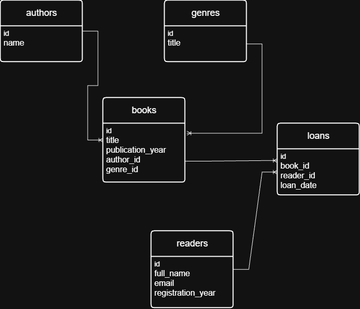

# HW1: Проектирование базы данных и запросы реляционной алгебры

## 1. Спроектированная ER-диаграмма

Выделено 5 сущностей:
1. `authors` — авторы книг.
2. `genres` — жанры и категории книг.
3. `books` — книги в фонде библиотеки.
4. `readers` — зарегистрированные читатели.
5. `loans` — учет выдачи книг читателям.

### Диаграмма в нотации Crow's Foot:

---

## 2. Запросы на языке реляционной алгебры

### Запрос 1: Выборка ($\sigma$) и Проекция ($\pi$)
* **Формулировка на естественном языке**: Найти ФИО (`full_name`) и `email` всех читателей, зарегистрировавшихся в библиотеке после 2023 года.
* **Запись на языке реляционной алгебры**:
  $$\pi_{full\_name, email} \left( \sigma_{registration\_year > 2023} (readers) \right)$$

---

### Запрос 2: Соединение отношения ($\bowtie$)
* **Формулировка на естественном языке**: Получить список всех книг с указанием их названия (`title`), года издания (`publication_year`) и имени автора (`name`).
* **Запись на языке реляционной алгебры**:
  $$\pi_{books.title, books.publication\_year, authors.name} \left( books \bowtie_{books.author\_id = authors.id} authors \right)$$
