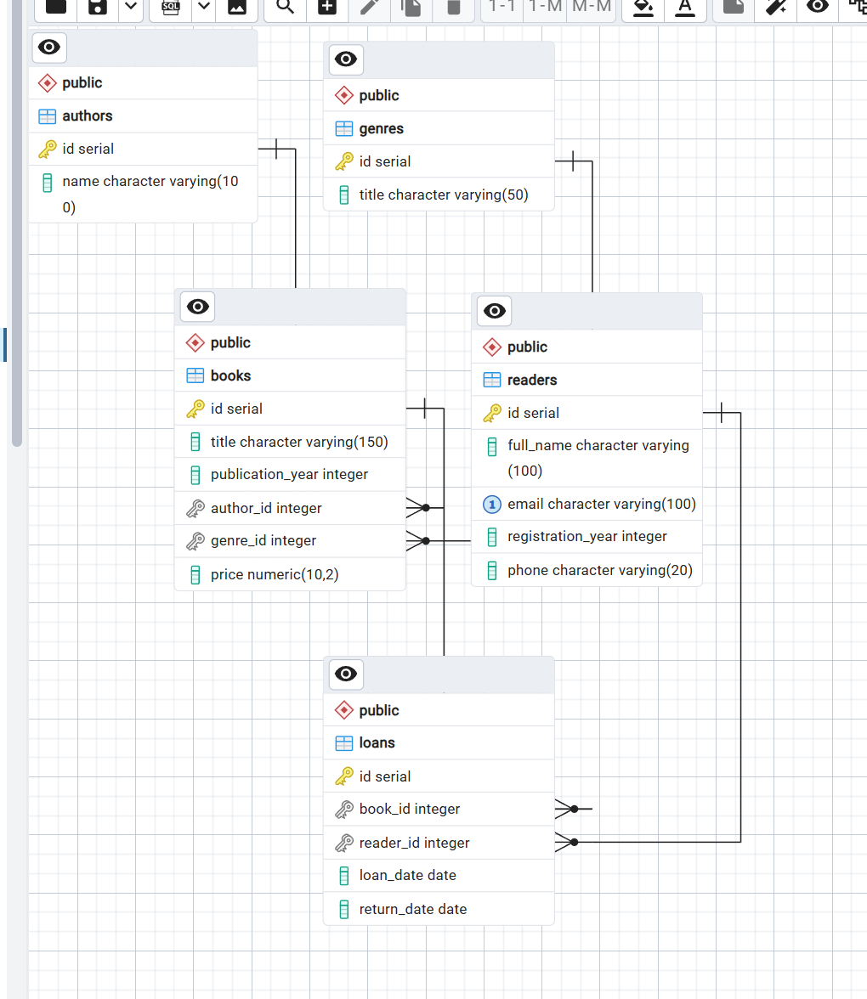

# HW2: Реализация базы данных в PostgreSQL

В рамках данного домашнего задания была развернута физическая схема базы данных для библиотеки, внесены изменения в структуру таблиц, а также выполнены операции наполнения и обновления данных.

---

## 1. Скрипт базы данных
Все DDL и DML запросы (`CREATE`, `ALTER`, `INSERT`, `UPDATE`) собраны в едином файле:
* [`script.sql`](./script.sql)

---

## 2. Структура таблиц в СУБД (pgAdmin)

Ниже представлена сгенерированная схема таблиц со всеми связями, ограничениями и добавленными через `ALTER` полями (`price`, `phone`, `return_date`):

