1. Выборка всех данных из таблицы 

1.1. Выбрать все строки и столбцы из books

SELECT * FROM books;
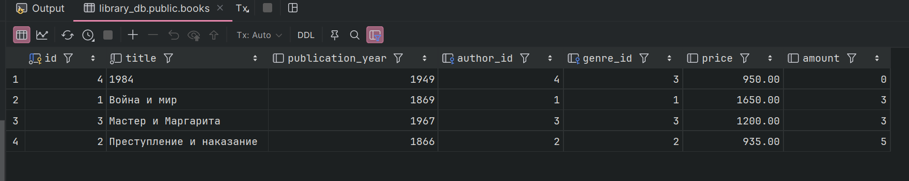

1.2. Выбрать все строки и столбцы из authors
SELECT * FROM authors;
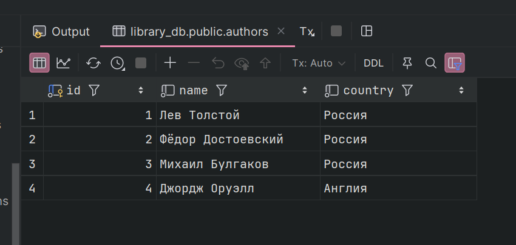

2. Выборка отдельных столбцов

2.1. Выбрать только строки, состоящие из loan_date, return_date из loans

SELECT loan_date, return_date FROM loans;
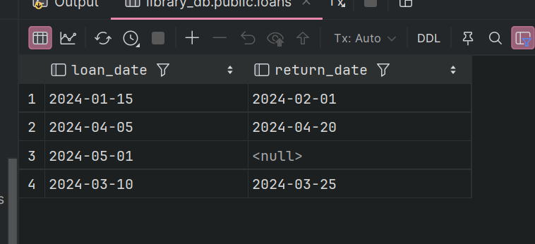

2.2. Выбрать строки, состоящие из title, price из books
SELECT title, price FROM books;
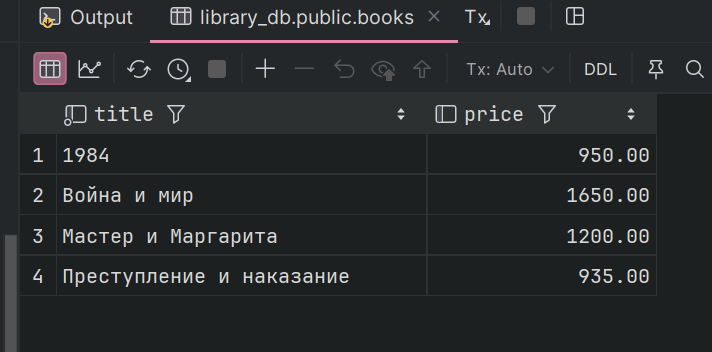

3. Присвоение новых имен столбцам при формировании выборки

3.1. Выбрать строки со столбцами ull_name, который будет с новым именем - ФИО , 
и email из readers

SELECT full_name AS ФИО , email FROM readers;
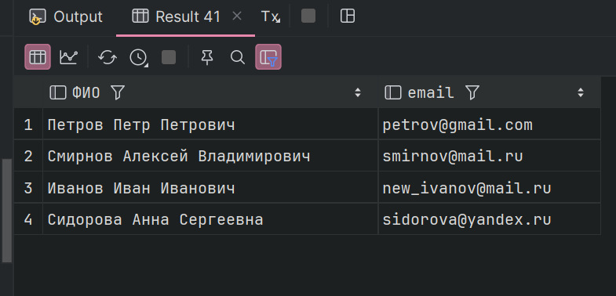

3.2. Выбрать строки со столбцами title, publication_year, который будет с новым именем -
Год издания, из books

SELECT title, publication_year AS "Год издания" FROM books;
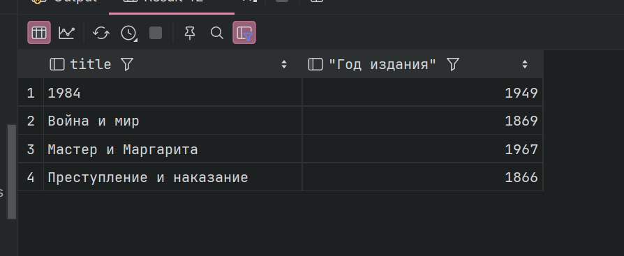

4. Выборка данных с созданием вычисляемого столбца

4.1. Выбрать title, amount, price и новый столбнц в котором будет сумма книг 
(цена на кол-во) из books

SELECT title, amount, price, price* amount AS total  FROM books;
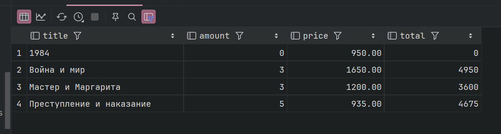

4.2.Выбрать id, loan_date, return_date и новый столбнц в котором будет кол-во дней из loans

SELECT id, loan_date, return_date, return_date-loan_date AS total FROM loans;
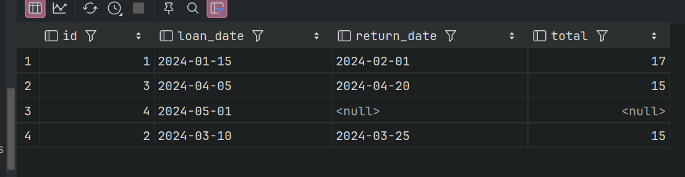

5. Выборка данных, вычисляемые столбцы, логические функции

5.1. Выбрать title, price, amount если кол-во от 2 до 4 то скидка 30%,
иначе 50%

SELECT title, price, amount,
    CASE
        WHEN  amount BETWEEN 2 AND 4 THEN price* 0.7
        ELSE price * 0.5
    END AS sale
FROM books;
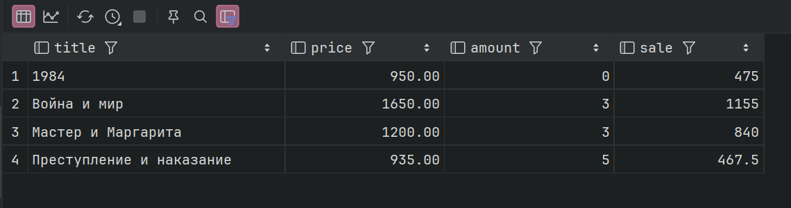

5.2.Выбрать title, publication_year, price если год издания до 1900, то скидка 10%

SELECT title, publication_year, price ,
    CASE
        WHEN publication_year < 1900 THEN  price *0.9
    END AS sale
FROM books;
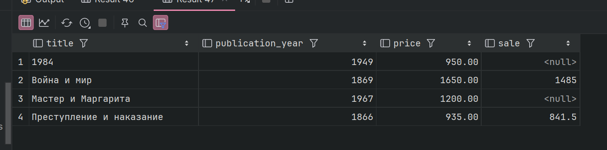

6. Выборка данных по условию

6.1. Выбрать title, publication_year из books где цена больше 1000

SELECT title, publication_year FROM books
    WHERE price > 1000;
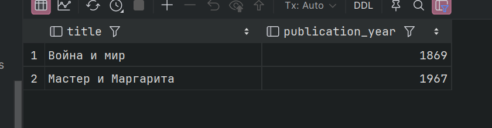

6.2. Выбрать full_name, email, registration_year из readers где год регистрации похже 2023

SELECT full_name, email, registration_year FROM  readers
    WHERE registration_year > 2023;
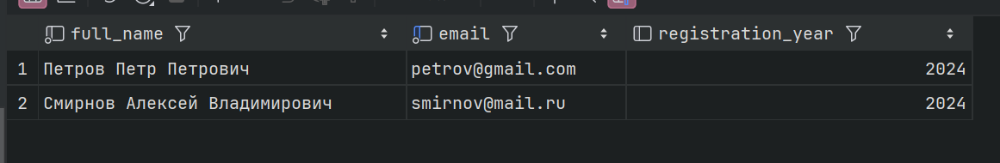

7.  Выборка данных, логические операции

7.1. Выбрать title, author_id, publication_year из books, где цена больше 1000 
и айди автора должно быть 3

SELECT title, author_id, publication_year FROM books
    WHERE price >1000 AND author_id = 3;
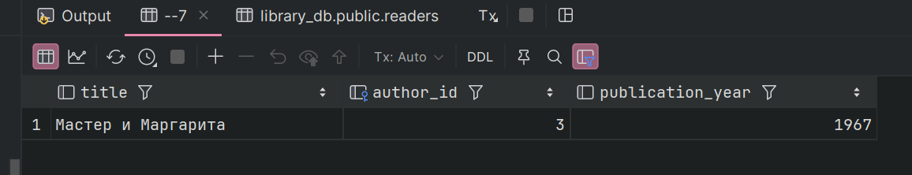

7.2. Выбрать reader_id, loan_date, return_date из loans, где дата брони позже 1го марта 2024
и дата возврата до 1го мая 2024

SELECT reader_id, loan_date, return_date FROM loans
    WHERE loan_date > '2024-03-01' AND return_date < '2024-05-01';
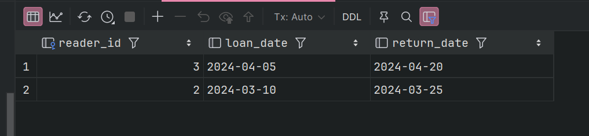

8. Выборка данных, операторы BETWEEN, IN

8.1. Выбрать title,publication_year из books где
год издания между 1900 и 1950

SELECT title,publication_year FROM books
    WHERE publication_year BETWEEN 1900 AND 1950;
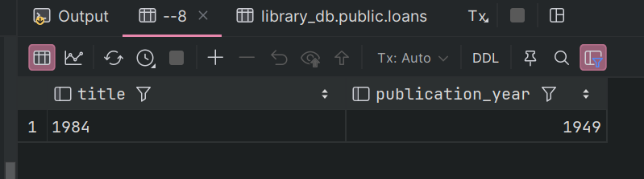

8.2. Выбрать title, author_id из books
где айди автора либо 2 либо 4

SELECT title, author_id FROM books
    WHERE author_id IN(2, 4);
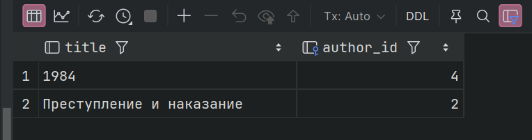

9. Выборка данных с сортировкой

9.1. Выбрать name, country из authors сортируя по странам

SELECT name, country FROM authors
    ORDER BY country;
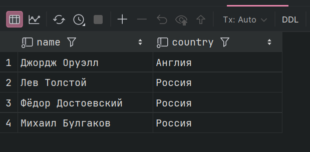

9.2. Выбрать full_name, phone из readers сортируя по full_name не по алфавиту

SELECT full_name, phone FROM readers
    ORDER BY full_name DESC ;
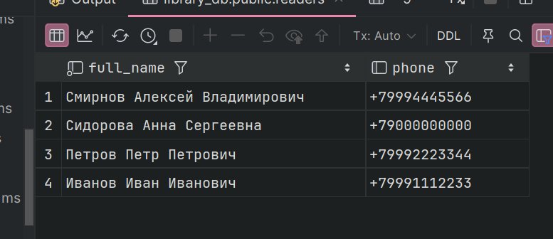

10. Выборка данных, оператор LIKE

10.1. Выбрать  full_name, email из readers где маил заканчивается на mail.ru

SELECT full_name, email FROM readers
    WHERE email like '%mail.ru';
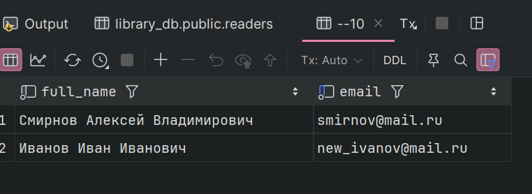

10.2. Выбрать title, publication_year из books где название состоит из 4 символов 
SELECT title, publication_year FROM books
    WHERE title like '____';
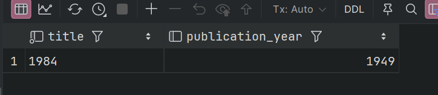

11. Выбор уникальных элементов столбца

11.1. Выбрать уникальные значениея genre_id из books

SELECT DISTINCT genre_id FROM books;
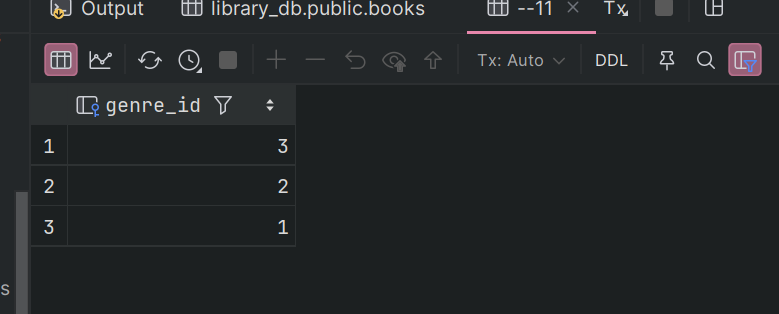

11.2. Выбрать уникальные значениея country из authors

SELECT DISTINCT country FROM authors;
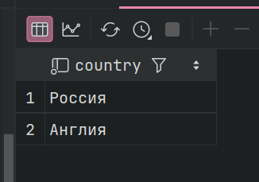

12. Выбор ограниченного количества возвращаемых строк.

12.1. ВЫбрать 3 name, country из authors сортируя по алфавиту country 

SELECT name, country FROM authors
    ORDER BY country
    LIMIT 3;
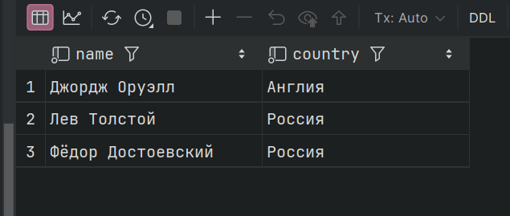

12.2. ВЫбрать 3 title, price из books сортируя по убыванию price

SELECT title, price FROM books
    ORDER BY price DESC
    LIMIT 3;
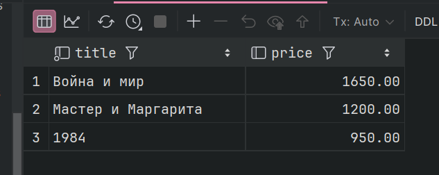

JOIN

13. Соединение INNER JOIN

13.1. Выбрать titl из bookse и name из authors соединяя по айди автора

SELECT title, name FROM books
    INNER JOIN authors
    ON authors.id = books.author_id;
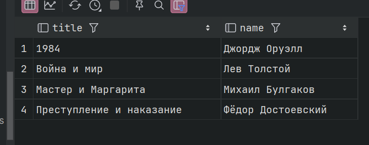

13.2.Выбрать title из bookse и return_date из loans соединяя по айди книги

SELECT title,return_date FROM books
    INNER JOIN loans
    ON books.id = loans.book_id;
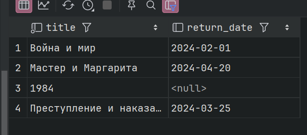

14. Внешнее соединение LEFT и RIGHT OUTER JOIN

14.1. Выбрать titl из bookse и name из authors соединяя по айди автора включая и авторов без книг

SELECT name, title FROM authors
    LEFT JOIN books
    ON authors.id = books.author_id
    ORDER BY name;
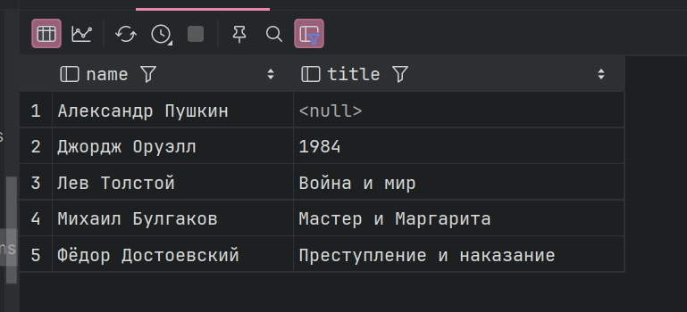

14.2. Выбрать title из bookse и return_date из loans соединяя по айди книги включая и 
книги, которых нет в loans

SELECT title, return_date FROM loans
    RIGHT JOIN books
    ON books.id = loans.book_id
    ORDER BY title;
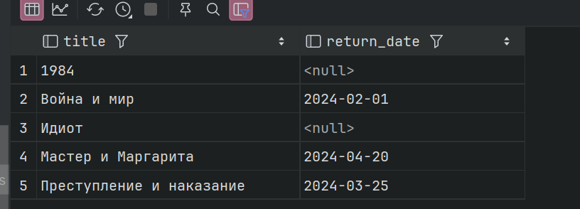

15. Перекрестное соединение CROSS JOIN

15.1. Выбрать name из authors и title из genres 

SELECT name, title FROM authors, genres;
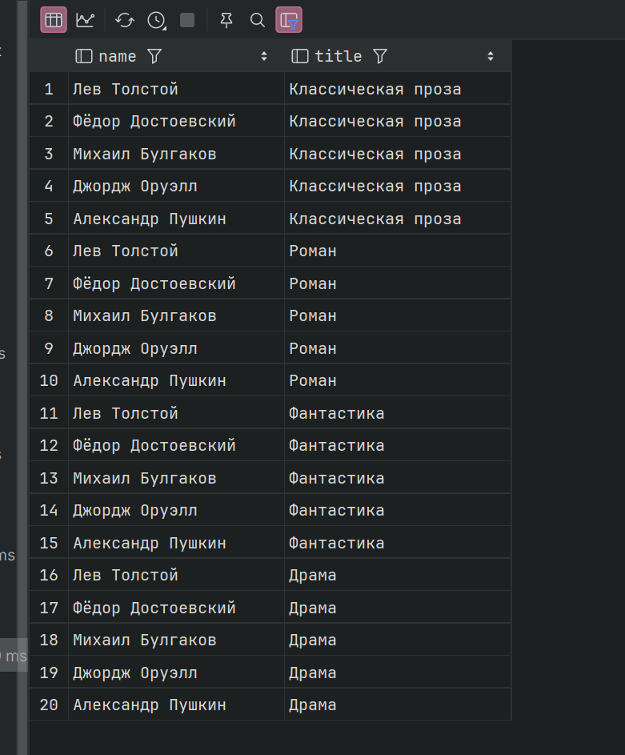

15.2. Выбрать все возможные комбинации ФИО читателей и названий книг

SELECT full_name, title FROM readers, books;
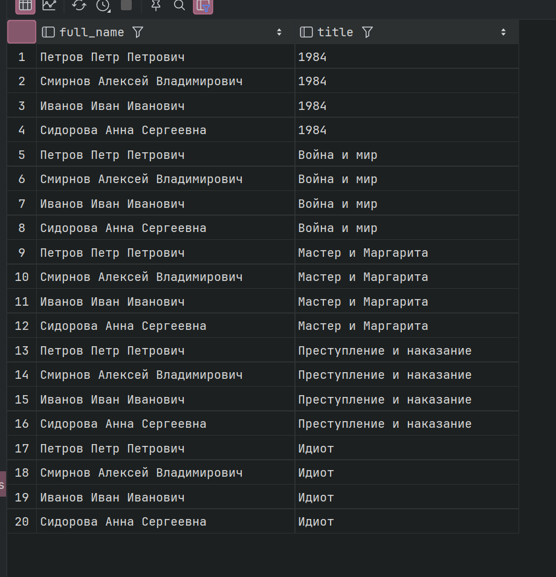

16. Запросы на выборку из нескольких таблиц

16.1. Выбрать ФИО читателя, название книги и дату выдачи

SELECT full_name, title, loan_date FROM readers
INNER JOIN loans ON readers.id = loans.reader_id
INNER JOIN books ON loans.book_id = books.id;
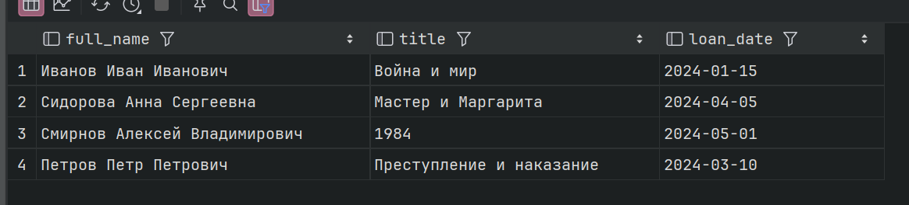

16.2.Выбрать имя автора, название книги и название жанра

SELECT authors.name, books.title, genres.title AS genre
FROM authors
INNER JOIN books ON authors.id = books.author_id
INNER JOIN genres ON books.genre_id = genres.id;
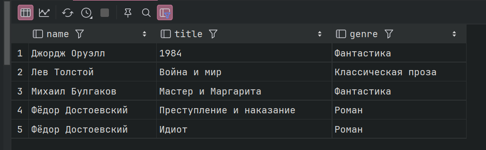